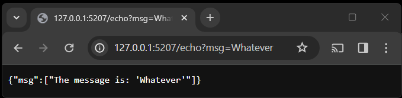
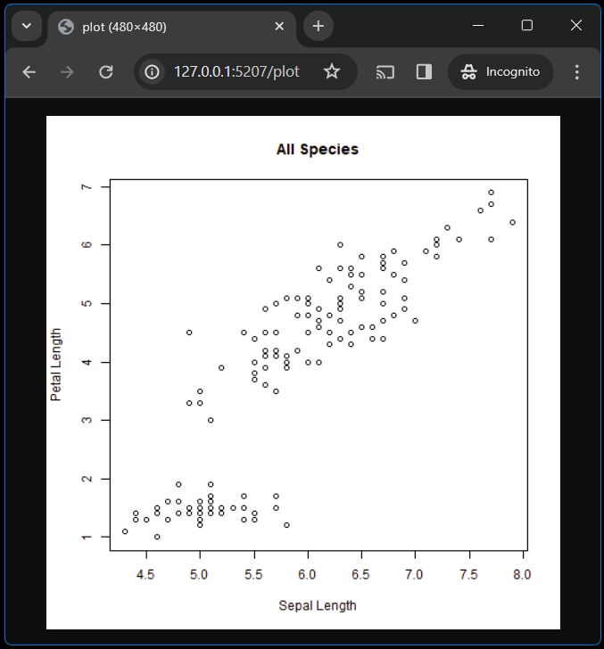

# How can I create an API?

**Learning objectives:**

-   Create an API with {plumber}.
-   Organize {plumber} API projects.
-   Design a RESTful API.
-   Implement a RESTful API in {plumber}.
-   Use {plumber} filters to process an API request.
-   Use {plumber} hooks to modify an API.
-   Debug a {plumber} API.

## plumber quickstart {-}


1.    Define API endpoints in an R script.
2.    Launch that API locally.
3.    *Later chapter(s): Deploy that API somewhere else.*

## echo endpoint: function {-}

```{r plumber-intro-echo1, eval = TRUE}
echo <- function(msg = "") {
  list(msg = paste0("The message is: '", msg, "'"))
}

echo("my message")
```

## echo endpoint: plumber {-}

```{r plumber-intro-echo2, eval = FALSE}
#* Echo back the input parameter
#* @param msg The message to echo back.
#* @get /echo
function(msg = "") {
  list(msg = paste0("The message is: '", msg, "'"))
}
```

## echo endpoint: plumber (alternate) {-}

```{r plumber-intro-echo2b, eval = FALSE}
#* Echo back the input parameter
#* @param msg The message to echo back.
#* @get /echo
echo <- function(msg = "") {
  list(msg = paste0("The message is: '", msg, "'"))
}
```

or

```{r plumber-intro-echo2c, eval = FALSE}
#* Echo back the input parameter
#* @param msg The message to echo back.
#* @get /echo
echo # Defined elsewhere
```

## echo endpoint in action {-}



## plot endpoint {-}

```{r plumber-intro-plot, eval = FALSE}
#* Plot out data from the iris dataset
#* @param spec If provided, filter the data to only this species (e.g. 'setosa')
#* @get /plot
#* @serializer png
function(spec) {
  myData <- iris
  title <- "All Species"

  # Filter if the species was specified
  if (!missing(spec)){
    title <- paste0("Only the '", spec, "' Species")
    myData <- subset(iris, Species == spec)
  }

  plot(myData$Sepal.Length, myData$Petal.Length,
       main=title, xlab="Sepal Length", ylab="Petal Length")
}
```

## plot endpoint in action {-}



## Launch the API {-}

-   `api <- pr("plumber.R")` 
-   `api <- pr() |> pr_post({definition}) |> etc()`
-   `api <- plumb(dir = "path/to/definition")`
    -   Looks for `entrypoint.R`, else `plumber.R`

In any case: `pr_run(api)` to run locally.

## Organize plumber projects {-}

-   Non-Package: 
    -   `plumber.R` = "main" file
        -   Can `source()` any other files, but
        -   `#*` defs must be in main file
    -   Alternative: `entrypoint.R` file to construct `api` programmatically
-   Package:
    -   `inst/plumber/{API_DIR_NAME}/plumber.R`
        -   Same rules as above, but filenames matter more
        -   Least surprise = use `entrypoint.R`
    -   `plumb_api(package = "{pkg}", name = "{API_DIR_NAME}")`
    -   `available_apis(package = "{pkg}")`

## Nest plumber APIs {-}

```{r plumber-intro-mount, eval = FALSE}
# Define in entrypoint.R

users <- pr("users.R")
products <- pr("products.R")

pr |> 
  pr_mount("/users", users) |> 
  pr_mount("/products", products)
```


## Design a RESTful API {-}

-   Endpoints = ***nouns***
    -   Subpaths = particular individual
        -   `/tasks` = all tasks, vs
        -   `/tasks/1234` = task ID 1234
-   Methods define action
    -   `GET` = fetch
    -   `POST` = create
    -   `PUT` = replace
    -   `PATCH` = modify
    -   `DELETE` = remove

## More on designing APIs {-}

-   Many books on just this
    -   [Designing APIs with Swagger and OpenAPI](https://livebook.manning.com/book/designing-apis-with-swagger-and-openapi) by Joshua S. Ponelat & Lukas L. Rosenstock
    -   (more suggestions to come)

## Implementing APIs in plumber {-}

-   Generally think of each method as a separate thing
-   `#* @get /tasks` totally separate block from `#* @post /tasks`
-   *Can* put multiple `@method`s in 1 block
    -   Function can use `req$REQUEST_METHOD` for routing
-   Remember `pr_mount()` for nested APIs!

## Process requests with filters {-}

-   Filter process before endpoints
-   `#* @filter FILTER_NAME`
-   Do one of 3 things at end:
    -   Forward control to next handler
    -   Return a response itself without forwarding to endpoint
    -   Throw an error
-   Inputs = `req` (the request object), `res` (the response object)
    -   More on these in next chapter


## Modify APIs with hooks {-}

-   Execute code at points in request lifecycle
    -   `preroute(data, req, res)`
    -   `postroute(data, req, res, value)`
    -   `preserialize(data, req, res, value)`
    -   `postserialize(data, req, res, value)`
-   `pr_hook()` for 1, `pr_hooks()` for multiple
-   Use for: logging, open/close DB connection, debugging

## Debug a plumber API {-}

-   `print()`, `cat()`, `cli::cli_inform()` in code to throw info to console
-   Use hooks to log things along the path
-   `browser()` in API functions will throw RStudio into debugger
-   `pr_set_debug()` is ***on*** by default when interactive


## Meeting Videos {-}

### Cohort 1 {-}

`r knitr::include_url("https://www.youtube.com/embed/URL")`

<details>
<summary> Meeting chat log </summary>

```
LOG
```
</details>
